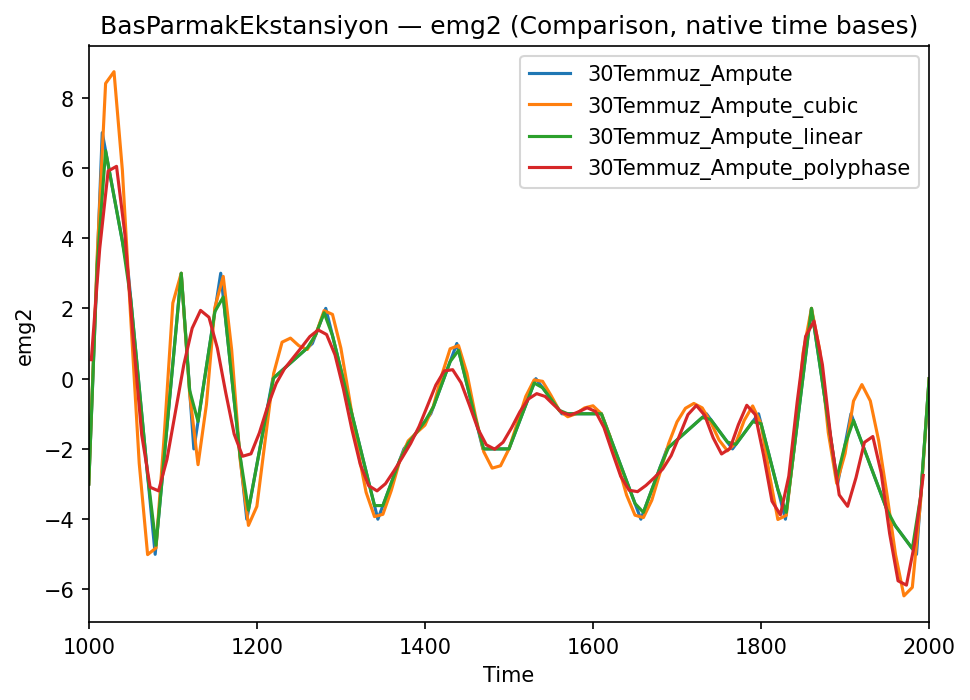

# EMG_Data_Project


## 1) Depoyu Klonla
```
git clone https://github.com/ajamiscoding/EMG_Data_Project)
cd EMG_Data_Project
```

## 2) Sanal Ortamı Oluştur ve Aktifleştir
**macOS / Linux**
```
python3 -m venv emg_venv
source emg_venv/bin/activate
```
**Windows (PowerShell)**
```powershell
python -m venv emg_venv
emg_venv\Scripts\Activate.ps1
```

## 3) Gereksinimleri Yükle
```bash
pip install -r requirements.txt
```

## 4) Projeyi Çalıştır

 tek tek yöntemleri çalıştır:
```
python Upsampling_linear.py
python Upsampling_cubic.py
python Upsampling_polyphase.py
```
Karşılaştırma Kodu:
```
python compare_emg_upsampling.py
```

## 5) Örnek Görsel




